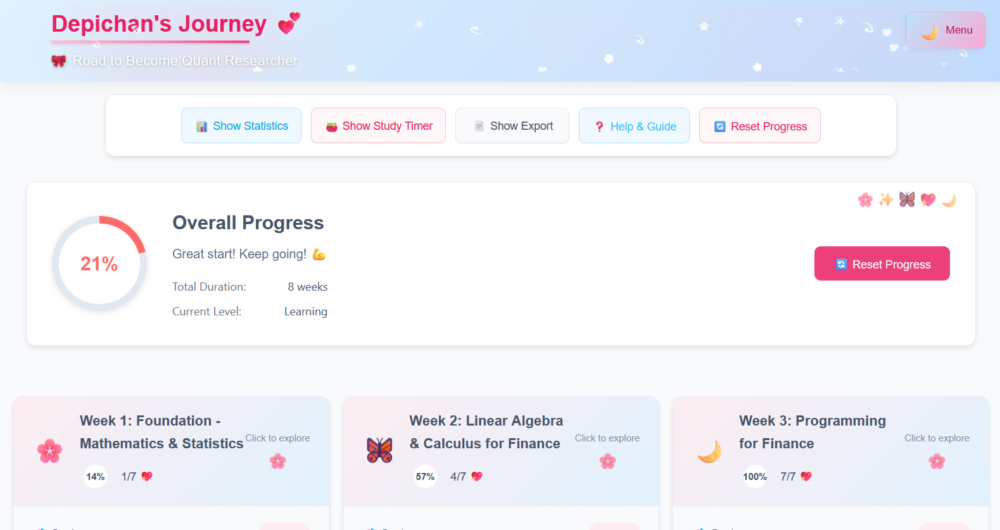
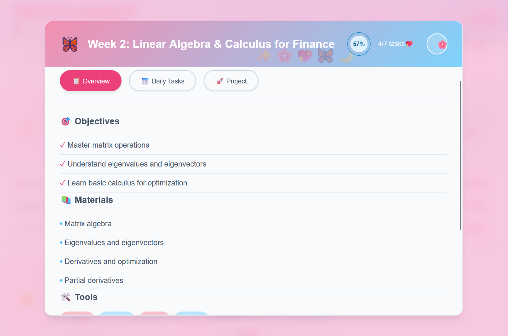
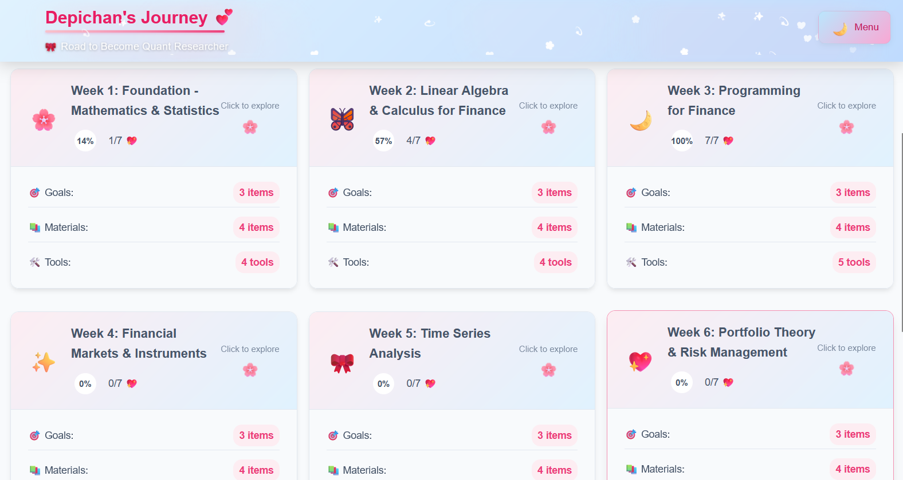

# 💙 Dep- **📊 Progress Tracking**: Re## 📋 Learning Curriculum (8 Weeks)l-time progress indicators wi1. \*\*🎮 Explorer Menu### 🎮 Explorer Menu System

- 🍱 Clean minimalist toggle button with pink-600 ## 👩‍💻 About

Created by **Depichan (Devi Rosa Aprilla)**, Mathematics student at Institut Teknologi Sepuluh Nopember (ITS).

_"Learning should be engaging, beautiful, and effective!"_

---

**Start your quantitative research journey today!** 🚀 Soft blue-pink gradient backgrounds without white

- 🎯 Quick access to all features: Statistics, Timer, Export, Help
- 💫 Smooth animations and glass-morphism effects
- 📱 Mobile-responsive with adaptive sizingck the cute menu toggle in the top-right corner to access all features

2. **🌸 Track Daily Tasks**: Click on those adorable checkboxes to mark tasks as completed
3. **📊 View Progress**: Watch your progress bloom in the header section with smooth animations
4. **🍅 Study Timer**: Use the kawaii Pomodoro timer for focused study sessionsisual feedback

- **✅ Task Management**: Interactive daily task checklist with completion tracking
- **📈 Analytics Dashboard**: Learning statistics with motivational insights
- **⏱️ Study Timer**: Built-in Pomodoro timer for focused study sessions
- **📄 Export Options**: Export progress as JSON, CSV, or HTML reports
- **🎮 Explorer Menu**: Clean navigation system for easy feature access
- **📱 Responsive Design**: Optimized for all devices with adaptive layouts
- **💾 Local Storage**: Secure local data storage with backup optionsKawaii Quant Journey

> A beautiful and interactive learning tracker for aspiring quantitative researchers

An adorable pink-blue themed application that guides you through a comprehensive 2-month journey to become a quantitative researcher with style and functionality.

## ✨ Key Features

- **📊 Progress Tracking**: Real-time progress indicators with visual feedback
- **✅ Task Management**: Interactive daily task checklist with completion tracking
- **� Analytics Dashboard**: Learning statistics with motivational insights
- **⏱️ Study Timer**: Built-in Pomodoro timer for focused study sessions
- **📄 Export Options**: Export progress as JSON, CSV, or HTML reports
- **� Explorer Menu**: Clean navigation system for easy feature access
- **� Responsive Design**: Optimized for all devices with adaptive layouts
- **💾 Local Storage**: Secure local data storage with backup optionss Kawaii Quant Journey 💙🌸

> _✨ A super cute and interactive learning tracker for aspiring quantitative researchers! ✨_

Welcome to the most adorable quant learning experience ever created! 🎀 This magical pink-blue themed application will guide you through your 2-month journey to becoming a quantitative researcher with style and cuteness!

## 🎯✨ Kawaii Features ✨🎯

- **🌸 Progress Tracking**: Adorable circular progress indicators with pastel colors
- **💖 Daily Task Checklist**: Cute checkboxes that sparkle when completed!
- **� Learning Statistics**: Beautiful analytics with motivational kawaii messages
- **� Pomodoro Timer**: Sweet study timer with gentle notifications and pink gradients
- **📄 Export Progress**: Export your journey as pretty JSON, CSV, or cute HTML reports
- **🌈 Responsive Design**: Looks absolutely gorgeous on any device!
- **💾 Local Storage**: Your progress is safely saved with magical localStorage powers

## � Learning Curriculum (8 Weeks)

### Week 1-2: Mathematical Foundations

- Probability theory and statistical distributions
- Linear algebra and matrix operations
- Calculus and optimization techniques
- Financial mathematics basics

### Week 3-4: Programming & Markets

- Python for financial analysis
- Data manipulation with Pandas
- Financial APIs and data sources
- Market structures and instruments

### Week 5-6: Analysis & Risk Management

- Time series analysis and forecasting
- Portfolio theory and optimization
- Risk metrics (VaR, Sharpe ratio)
- CAPM and factor models

### Week 7-8: Trading & Research

- Algorithmic trading strategies
- Backtesting frameworks
- Quantitative research methods
- Academic paper analysis

## 🛠️ Technology Stack

- **Frontend**: React 19.x with Vite
- **Styling**: Pure CSS with custom design system
- **Storage**: Browser localStorage
- **Build**: Vite for fast development
- **Design**: Mobile-first responsive approach

## � Quick Start

### Prerequisites

- Node.js (v16+)
- npm or yarn

### Installation

```bash
git clone github.com/depichan18/quant-roadmap/
cd quant-roadmap
npm install
npm run dev
```

**Live Demo**: [click here](http://localhost:5174/)

### Build for Production

```bash
npm run build
```

## 📖🎀 How to Use (Step by Step Cuteness!) 🎀📖

1. **� Explorer Menu**: Click the cute menu toggle in the top-right corner to access all features
2. **�🌸 Track Daily Tasks**: Click on those adorable checkboxes to mark tasks as completed
3. **📊 View Progress**: Watch your progress bloom in the header section with smooth animations
4. **� Study Timer**: Use the kawaii Pomodoro timer for focused study sessions
5. **📈 Statistics**: View your learning journey with cute analytics and motivational messages
6. **📄 Export Data**: Save your progress in pretty formats (JSON, CSV, HTML)
7. **❓ Help & Guide**: Access helpful information through the help modal
8. **🔄 Reset Progress**: Start fresh anytime with a gentle reset

## 🎨💖 Kawaii Features in Detail 💖🎨

### 🌸 Progress Tracking

- ✨ Real-time progress calculation with sparkles
- 🎀 Adorable circular progress indicators in pastel colors
- 📊 Week-by-week completion tracking with cute animations
- 💕 Motivational kawaii messages based on your progress

### � Explorer Menu System

- 🍱 Clean minimalist toggle button with pink-600 text
- 🌈 Soft blue-pink gradient backgrounds without white
- 🎯 Quick access to all features: Statistics, Timer, Export, Help
- 💫 Smooth animations and glass-morphism effects
- 📱 Mobile-responsive with adaptive sizing

### 🍅 Study Timer

- ⏰ 25-minute study sessions (perfect for focus!)
- 🛀 5-minute break periods (time to relax!)
- 🎯 Visual countdown with beautiful circular progress
- 🔔 Gentle desktop notifications when sessions complete
- 🔄 Automatic session switching (so convenient!)

### 📄 Export Options

- **🌸 JSON**: Complete data export for backup (so organized!)
- **📊 CSV**: Spreadsheet-friendly format (for the data lovers!)
- **📋 Report**: Pretty HTML report for printing (share your journey!)

### 📈 Statistics Dashboard

- ✅ Total tasks completed (your achievements!)
- 🏆 Weeks finished (milestone tracker!)
- 📍 Current week indicator (where you are now!)
- 📊 Average weekly progress (your consistency!)
- 💖 Motivational kawaii feedback (you're doing great!)

## 🖼️ Feature Previews


_Main dashboard with progress tracking_

  
_Detailed analytics and completion tracking_


_Interactive week cards with task management_

## 🔧 Customization

- **Roadmap**: Edit `src/data/roadmapData.json` to modify curriculum
- **Styling**: Update CSS files in `src/components/` for visual changes
- **Colors**: Modify CSS custom properties for theme adjustments

## 📱 Device Support

Fully responsive design optimized for:

- Desktop computers
- Tablets and mobile devices
- Various screen orientations

## 🔐 Privacy & Security

- All data stored locally in your browser
- No external servers or data collection
- Export options for easy backup and portability

## 🤝 Contributing

This project welcomes contributions! Feel free to:

- Fork the repository and submit pull requests
- Report bugs or suggest new features
- Improve documentation or curriculum content

## 📄 License

MIT License - Free to use and modify

## 👩‍� About

Created by **Depichan (Devi Rosa Aprilla)**, Mathematics student at Institut Teknologi Sepuluh Nopember (ITS).

_"Learning should be engaging, beautiful, and effective!"_

---

**Start your quantitative research journey today!** �
